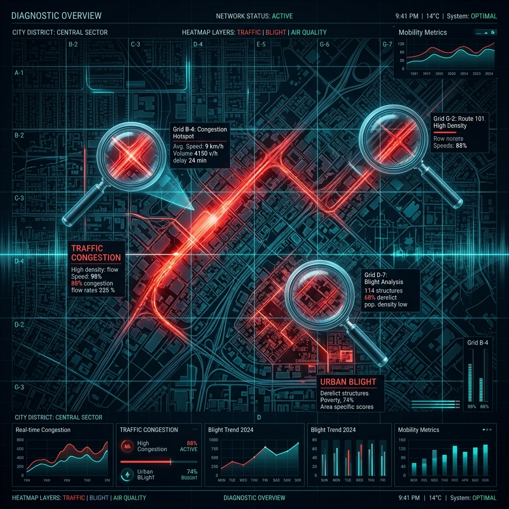
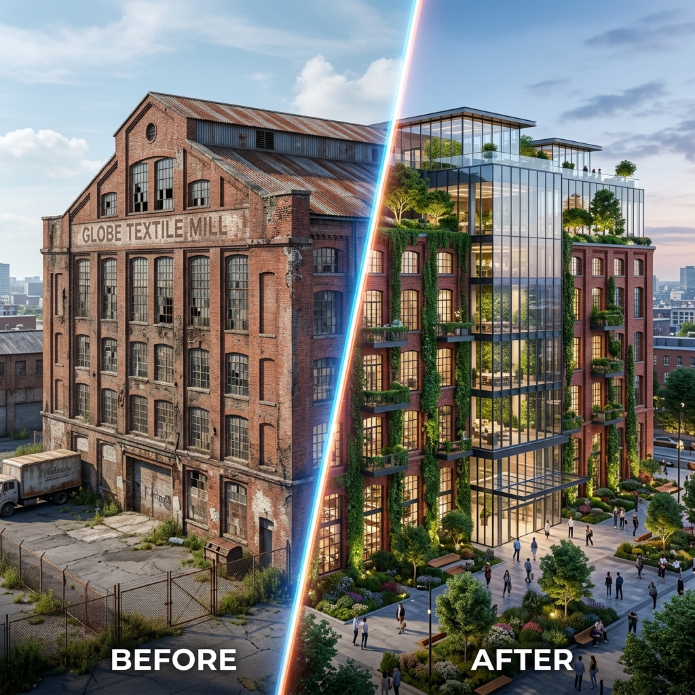
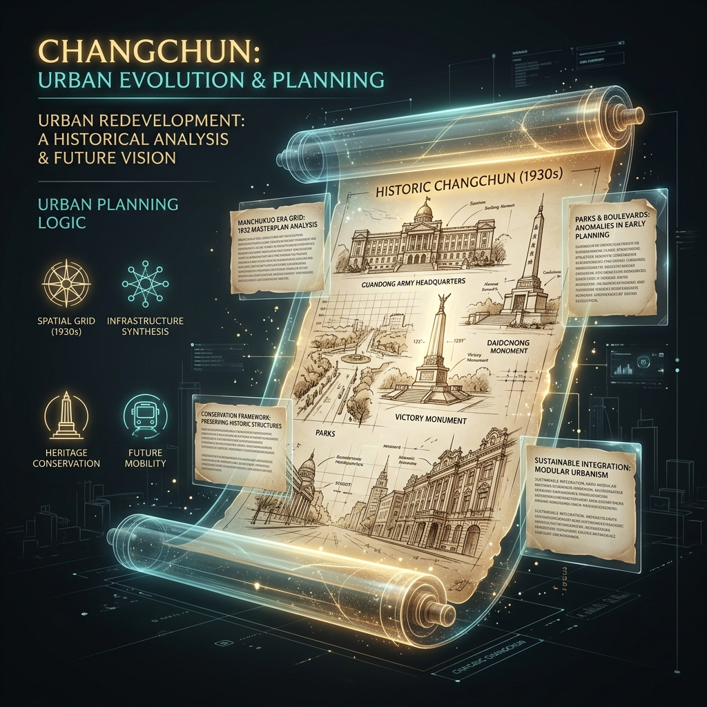

<p align="right">
  <a href="README_EN.md">English Version</a> | <strong>中文版</strong>
</p>

<h1 align="center">🏙️ UltimateDESIGN</h1>
<h3 align="center">长春伪满皇宫周边街区微更新决策支持平台</h3>

<p align="center">
  
  
  
  
  
</p>

<p align="center">
  面向城乡规划毕业设计与城市更新研究的循证式工作流平台。<br/>
  围绕长春伪满皇宫周边街区，将任务书、开题报告、空间数据、AIGC 图景推演、LLM 多主体协商和成果展示整合为一套完整的决策支持系统。
</p>

---

## ✨ 功能亮点

- 📊 **数据底座** — MPI 更新潜力评估、空间数据资产清单、任务书/开题报告智能资料台
- 🗺️ **现状诊断** — 3D 现状底座、建筑/地块/POI/交通/街景品质多图层叠加、地块雷达诊断
- 🎨 **AIGC 推演** — 基于 Stable Diffusion 的空间图景生成、Before/After 对比、历史图集
- 🤖 **LLM 博弈** — RAG 政策检索、五阶段循证推演、多主体协商、共识雷达可视化
- 📋 **成果展示** — 设计总图、导则文本、效果图集、Word 文档一键导出

## 📸 模块预览

| 数据底座与规划策略 | 现状空间全景诊断 | AIGC 设计推演 |
|:-:|:-:|:-:|
|  |  |  |

| LLM 博弈决策 | 更新设计成果展示 | 系统配置 |
|:-:|:-:|:-:|
|  |  |  |

---

## 🚀 快速启动

> **轻量演示模式** — 无需 GPU 或 AI 引擎，可直接查看首页、空间数据、3D 地图、诊断结果和成果展示。详情请参考 [QUICK_START.md](QUICK_START.md)。

### 环境要求

| 项目 | 轻量演示模式 | 全量本地模式 |
| --- | --- | --- |
| 操作系统 | Windows / macOS / Linux | Windows 10/11 优先 |
| Python | 3.10 ~ 3.12 | 3.10 ~ 3.12 |
| 内存 | ≥ 8 GB | ≥ 16 GB |
| GPU | 不需要 | NVIDIA RTX 3060 8GB+ |

### 安装与运行

```powershell
# 克隆仓库
git clone https://github.com/Chain813/ultimate-design.git
cd ultimate-design

# 创建虚拟环境并安装依赖
python -m venv .venv
.\.venv\Scripts\activate
pip install -r requirements.txt

# 运行应用
streamlit run app.py
```

启动后浏览器访问 → `http://localhost:8501`

---

## 🤖 AI 引擎部署

如果需要实时生图和 LLM 协商，请参考以下详细指南：

- [INSTALL_GUIDE.md](INSTALL_GUIDE.md)：全量本地环境与 AI 引擎（SD / Ollama）部署指南。

---

## 📁 项目结构与开发

- [PROJECT_STRUCTURE.md](PROJECT_STRUCTURE.md)：详细的项目目录职责、UI 层约定与维护说明。
- [GITHUB_UPLOAD_GUIDE.md](GITHUB_UPLOAD_GUIDE.md)：GitHub 上传规范、代码清理规则及 Streamlit Cloud 部署流程。

### 🧪 校验命令

```powershell
# 语法检查
python -m py_compile app.py src/ui/design_system.py src/ui/chart_theme.py src/ui/ui_components.py
# 单元测试
python -m pytest tests/ -q
# 启动冒烟测试
python tools/startup_smoke.py
```

---

## 📜 使用声明

本项目用于学术研究、课程展示和毕业设计演示。项目中的规划资料、空间数据和社会感知数据应按来源授权和隐私要求使用，不建议直接用于商业决策。
