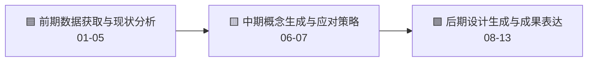

# 🏙️ UltimateDESIGN

**长春伪满皇宫周边街区微更新与城市设计决策支持平台**

UltimateDESIGN 是一个面向城乡规划专业城市设计课程、毕业设计和研究展示的 Streamlit 应用。项目把城市设计工作拆解为 **13 个专业阶段**，并把资料读取、空间分析、现场调研、AIGC 图景推演、LLM 协商决策和成果表达整理成清晰的模块化页面。

> 当前版本强调“顶部导航直达功能”。页面主体不再放置二次跳转卡片，避免中转和重复入口。

## 🧭 快速理解

| 图标 | 关键词 | 说明 |
| --- | --- | --- |
| 🧩 | 13 阶段流程 | 按城乡规划专业城市设计工作流组织页面顺序 |
| 🗺️ | 数据底座 | 统一管理任务书、开题报告、GeoJSON、POI、交通和街景数据 |
| 🔎 | 现状诊断 | 基于空间指标、街景指标和地块信息生成诊断面板 |
| 🧠 | AI 协同 | 接入 Stable Diffusion、Ollama/Gemma、RAG 政策检索和多主体协商 |
| 🖼️ | 设计表达 | 生成图景推演、图纸提示词、规划文本和成果导出 |

## 🧱 三大板块与 13 阶段



| 板块 | 阶段 | 页面入口 |
| --- | --- | --- |
| 🟦 前期数据获取与现状分析 | 01 任务解读、02 资料收集、03 现场调研、04 现状分析、05 问题诊断 | `pages/01_前期数据获取与现状分析.py` |
| 🟨 中期概念生成与应对策略 | 06 目标定位、07 设计策略 | `pages/02_中期概念生成与应对策略.py` |
| 🟩 后期设计生成与成果表达 | 08 总体城市设计、09 专项系统设计、10 重点地段深化、11 实施路径、12 城市设计导则、13 成果表达 | `pages/03_后期设计生成与成果表达.py` |

## 🧰 功能页面与子页面结构

系统将专业工作流抽象为 5 个核心功能页面和 1 个现场调研页面。每个页面内部通过子页面（Subpage）和具体的算法模块（Function）来承载细粒度的设计推演工作。

### 🏠 首页入口 (`app.py`)
- **平台状态**：展示底层算力设施（SD、Gemma）、空间测度状态与数据资产挂载雷达。
- **街区范围及改造红线**：提供全局 2D/3D 基底与图层控制，校核项目边界。
- **核心子系统导览**：提供进入 01-05 核心研究板块的路由。

### 🚶 现场调研 (`pages/04_现场调研.py`)
- **街景样本库**：直接读取本地 `streetview` 文件夹，按调研点提供坐标信息与四向（0/90/180/270度）街景照片的检索核对。

### 📚 页面01: 数据底座与规划策略 (`pages/11_数据底座与规划策略.py`)
- **资产综合评估**：AHP 权重配置模拟专家研判；实时 MPI 更新潜力测度与重点地块排行榜生成；MPI公式与耦合散点图展示；评估排行榜导出 (CSV)。
- **策略语义萃取**：任务书与开题报告原文依据台；批量将 PDF/Word 转化为结构化 Markdown 的语义萃取配置与预览。
- **物理底座管理**：全量空间数据资产清单（边界、建筑、POI、街景等）核对；数据一键预览与覆盖上传能力。

### 🗺️ 页面02: 现状空间全景诊断 (`pages/12_现状空间全景诊断.py`)
- **3D现状全息底座**：物理基底（建筑、用地）图层控制；社会活力（POI、交通拥堵）叠加；街景品质（GVI、SVF）3D柱体评价；自由 3D/2D/漫游视角与仿真光照控制。
- **地块级诊断面板**：继承 MPI 提供更新潜力排行榜；逐地块雷达多维指标评价及靶向干预建议；地块诊断报告导出 (CSV)。

### 🎨 页面03: 街区风貌修缮预演 (`pages/13_AIGC设计推演.py`)
- **地块导向推演**：选择重点更新单元，按指标获得策略推荐。
- **空间生形模式**：支持街区全景透视推演（现状修缮）、概念总平面图生形、以及轴测鸟瞰空间体块模拟。
- **空间测算与约束参数**：提供 ControlNet (Canny/MLSD/Depth/Seg) 算子用于约束 AI 的结构网格；开放画质重构、采样和提示词相关性等进阶参数。
- **输入与约束**：底图上传、旋转/裁剪几何校正；内置规划算子与二阶段策略库驱动生成；支持自定义 Prompt/Negative Prompt 及重绘幅度。
- **生成结果与对比**：交互式 Before/After 滑块对比；本地文件下载及会话历史画廊。

### 🤝 页面04: 数字城市议事厅 (`pages/14_LLM博弈决策.py`)
- **多主体利益协商**：
  - *阶段一：前期分析*：将核心数据转化为结构化的前期问题诊断报告。
  - *阶段二：方案借鉴*：对接外部经验，形成案例对标分析报告。
  - *阶段三：设计理念*：提炼总体设计愿景、目标与策略。
  - *阶段四：问题-策略对应*：基于 RAG 政策合规预审，启动居民、开发商、规划师的三角色多方智能协商推演。
  - *阶段五：空间成果方案*：自动整理出最终的图文规划导则报告。
- **动态共识雷达**：可视化三方协商后的核心矛盾与共识度。
- **图纸提示词助手**：专为 Image 2.0 图纸生成设计的专家系统；提供信息完整度校验，并按 A/B/C/D 评级提供修正后的渲染提示词。

### 📦 页面05: 更新设计成果展示 (`pages/15_更新设计成果展示.py`)
- **更新设计大地图**：集成修缮保护、功能改造等图层的留改拆总图展示；支持地下管网 X-Ray 透视联动。
- **规划文本成果**：成果依据（任务书/规范）快捷下载；导则总则与实施要点线上展示；包含图文的“宽城区历史文化街区微更新规划导则” Word 成果导出。
- **重点地块效果图**：统筹管理本次会话的 AIGC 推演图集与本地存量的成果示意图库；提供推演历史一键清理功能。

## 📁 代码结构

```text
ultimateDESIGN/
├─ 🏠 app.py                       # Streamlit 首页、平台状态、总入口
├─ 🧭 pages/                       # Streamlit 页面，文件名影响路由顺序
├─ 🧬 src/
│  ├─ ⚙️ config/                   # 项目路径、数据路径、配置加载
│  ├─ 🧠 engines/                  # 领域引擎：空间、诊断、RAG、LLM、AIGC、提示词
│  ├─ 🎛️ ui/                       # 顶部导航、页面设计系统、图表主题
│  ├─ 🧰 utils/                    # 文本读取、文档导出、坐标转换、服务探测
│  └─ 🧩 workflow/                 # 13 阶段城市设计工作流与阶段路由映射
├─ 🎨 assets/                      # 全局 CSS、HTML 地图模板、展示资源
├─ 🗃️ data/                        # GeoJSON、CSV、街景图、语义中间文件
├─ 📄 docs/                        # 本地任务书、开题报告、规范和政策资料
├─ 🛠️ tools/                       # 数据抓取、清洗、压缩、环境检查脚本
├─ ✅ tests/                       # 单元测试
└─ 🌐 static/                      # Streamlit 静态资源目录
```

## 🧠 核心模块命名

| 图标 | 模块 | 职责 |
| --- | --- | --- |
| 🧭 | `src/ui/app_shell.py` | 全局 CSS 注入、顶部导航、引擎状态提示 |
| 🧩 | `src/workflow/city_design_workflow.py` | 13 阶段定义、阶段资源、顶部导航直达 URL |
| 🧠 | `src/engines/engine_registry.py` | 跨领域聚合导出，供页面按需使用 |
| 🗺️ | `src/engines/spatial_engine.py` | POI、街景、天际线、空间数据统计 |
| 🔎 | `src/engines/site_diagnostic_engine.py` | 地块诊断、策略矩阵、问题判断 |
| 🎨 | `src/engines/stable_diffusion_engine.py` | 本地 Stable Diffusion WebUI 调用 |
| ✍️ | `src/engines/drawing_prompt_engine.py` | 城市设计图纸提示词生成 |
| 📚 | `src/engines/rag_engine.py` | 政策文本向量检索和上下文召回 |
| 🤖 | `src/engines/llm_engine.py` | Ollama/Gemma 调用与流式输出 |
| 💬 | `src/engines/nlp_engine.py` | 社交文本情感和词频分析 |
| 🕸️ | `src/engines/social_media_crawler.py` | 社交平台抓取逻辑 |
| 🖼️ | `src/engines/urban_image_segmentation.py` | 街景图像语义分割和城市指标计算 |

## 🚀 启动

```powershell
pip install -r requirements.txt
streamlit run app.py
```

浏览器访问：

```text
http://localhost:8501/
```

## 🧪 验证

```powershell
python -m compileall app.py pages src tests tools
pytest
python tools/check_env.py
python tools/startup_smoke.py
```

## 🗃️ 数据说明

| 图标 | 路径 | 内容 |
| --- | --- | --- |
| 🗺️ | `data/shp/` | 研究边界、建筑底图、地块和空间 GeoJSON |
| 🚶 | `data/streetview/` | 现场调研街景图片，按 `Point_x/heading_*.jpg` 组织 |
| 🧾 | `data/meta/` | 任务书摘录、政策约束抽取、语义萃取中间结果 |
| 📄 | `docs/` | 本地 PDF、Markdown 规划资料、任务书和开题报告 |
| 🎨 | `assets/` | CSS、HTML 地图模板、页面展示资源 |

## 🛠️ 开发规则

- 🧭 页面跳转只放在顶部导航，页面主体不再放功能跳转卡片。
- 🧩 13 阶段流程只维护在 `src/workflow/city_design_workflow.py`。
- 🧠 计算逻辑放在 `src/engines/` 或 `src/utils/`，不要写进页面文件。
- 🎛️ 通用 UI 放在 `src/ui/`，页面内只保留必要交互和展示。
- 🗃️ 新增数据路径先登记在 `src/config/paths.py`。
- ✅ 修改后至少运行 `compileall`、`pytest` 和 `tools/check_env.py`。

## 📌 使用声明

本项目用于课程设计、毕业设计和学术研究展示。规划资料、街景数据和社会感知数据应按来源授权、隐私要求和学校/项目管理要求使用。
