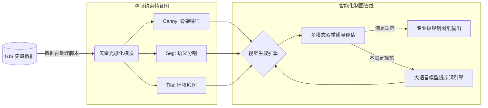
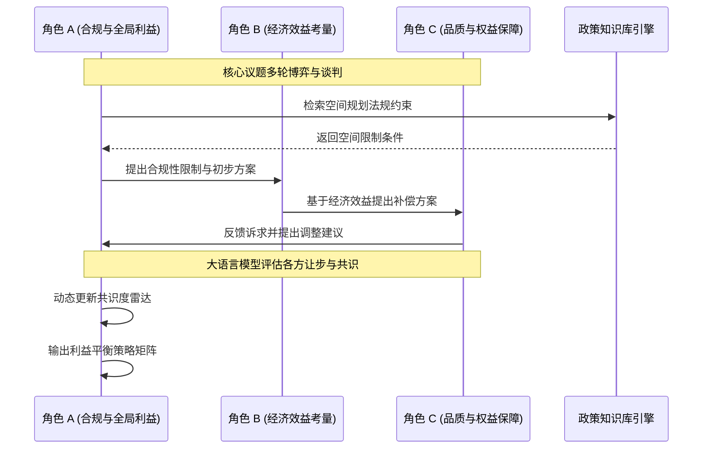
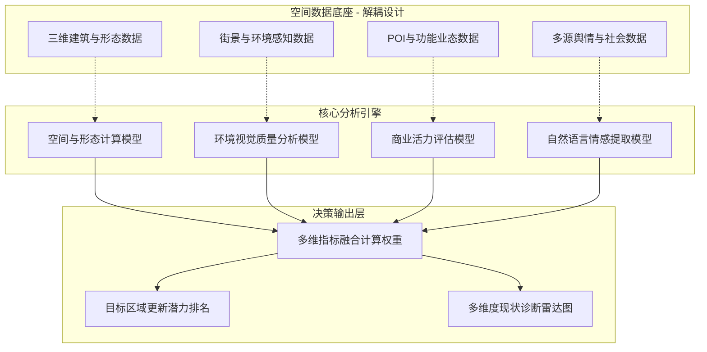

[**English**](./README_EN.md) · [**简体中文**](./README.md)

<div align="center">

# UltimateDESIGN

**AI 赋能下的城市设计与微更新规划决策支持平台**

*Streamlit 全栈引擎 · 数据与逻辑解耦 · 17 逻辑阶段 · 15 物理页面 · AIGC 空间对齐制图管线 · 端到端循证工作流*

[](https://python.org)
[](https://streamlit.io)
[](./tests/)
[]()

</div>

---

## 🌟 项目概况

UltimateDESIGN 是面向城乡规划与城市设计的 **Streamlit 全栈智慧决策支持平台**。平台通过**数据与逻辑的彻底解耦**设计，支持导入任意城市的规划地块（自带长春伪满皇宫周边 170.2 公顷街区作为验证与实证案例）。它将城市更新设计拆解为 17 个标准化逻辑阶段 (00-16)，打通「GIS 数据采集 → LLM 循证推演 → 矢量/光栅图纸绘制 → AIGC 意向重绘 → 智能化交付与图则」的完整数字孪生工作流。

> 🎉 **最新特性：开箱即用的免安装绿色版**
> 现已支持基于 **WinPython 3.12+** 的全隔离便携式打包方案。所有环境依赖、GIS 底层 C++ 动态库全部封装于单一文件夹内，配合系统自带的 `安装向导_UltimateDESIGN.bat`，可实现**一键释放、防污染独立运行及自动生成快捷方式**，极大降低了项目向非技术型设计师分发的门槛。

---

## ✨ 核心亮点

| 能力 | 说明 |
|---|---|
| **17 阶段精简工作流** | 包含 17 个逻辑阶段 (00-16)，物理上合并为主入口 app.py 及 14 个侧边栏功能页面 |
| **26 张专业图纸模板** | 基于 Python 空间矢量绘图与 PIL 自动排版引擎，高精度生成符合国标与工程规范 of A3 图册 |
| **GIS → AIGC 空间对齐** | 首创「矢量→光栅→ControlNet」管线，消除 AI 制图的空间幻觉 |
| **DesignContext 设计纲要** | 统一提取 19 个阶段 AI 文本输出，LLM 合成结构化设计纲要，驱动图纸生产 |
| **策略驱动 AIGC 渲染** | 6 种设计策略风格（历史保护/微更新/功能置换/TOD/生态/文创）自动匹配渲染参数 |
| **三主体博弈推演** | LLM 驱动居民 / 开发商 / 规划师角色对抗，输出共识度雷达与策略矩阵 |
| **双重质量闭环** | Gemma 视觉 + DeepSeek 内容双评估，C/D 级图纸自动修正重生成 |
| **后台缓存预加载** | daemon 线程静默预热 37MB GeoJSON、RAG 模型等，页面切换秒开 |
| **引擎懒加载** | `__getattr__` 模式延迟加载 pandas/numpy/PIL，启动速度提升 |
| **录屏自动滑动组件** | 页面右下角常驻防穿帮录屏控制器，支持帧率级平滑像素滚动与快捷键交互 |
| **238 项自动化测试** | Pytest 全覆盖 + CI 集成 lint / 密钥扫描 / 冒烟测试 / 数据质量检查 |

---

## 🤝 参与贡献 (Contributing)

我们欢迎任何形式的贡献！无论是提交 Issue 报告 Bug、提出新功能建议，还是提交 Pull Request 改进代码，我们都非常感谢。

在开始贡献之前，请务必阅读我们的 [**贡献指南 (CONTRIBUTING.md)**](./CONTRIBUTING.md)，其中详细说明了：
- 如何配置本地开发与测试环境
- 代码风格与 Linting 规范 (Ruff + Mypy)
- 提交 Pull Request 的标准流程
- 核心 API 与架构概览

---

## 🧩 核心功能模块详解

### 1. 🎨 GIS-to-AIGC 空间对齐与制图管线 (Spatial Alignment & Mapping Pipeline)
这是本平台首创的**“矢量→光栅→ControlNet”**端到端制图管线，彻底消除了生成式 AI 在规划制图中的“空间幻觉”。
* **空间控制原件渲染**：通过 `scripts/render_gis_assets.py` 读取研究范围内的 GeoJSON 矢量图层，自动渲染为黑白二值化的路网骨架（用于 Canny 边缘检测）、彩色用地分区（用于语义 Seg 分割）及建筑轮廓深度图（Depth）。
* **端到端编排管线**：`DrawingPipeline` 负责全流程的管理调度。首先利用大语言模型（LLM）根据图纸模板要求生成最贴合的专业英文 Prompts，然后将其与光栅化的 GIS 图像一同送入 Stable Diffusion 渲染引擎。
* **双重质量闭环评估**：图纸生成后，系统调用 `Gemma` 视觉大模型评估图纸图像质量，结合 `DeepSeek` 进行文本内容审查，综合评定为 A/B/C/D 四个级别。评级为 C/D 的图纸将被拦截并自动优化提示词参数发起重绘，确保最终产出百分之百符合工程绘图规范。


```mermaid
flowchart LR
    A[(GIS 矢量数据)] -->|数据预处理脚本| B(矢量光栅化模块)
    
    subgraph Features [空间约束特征图]
        B --> C1[Canny: 骨架特征]
        B --> C2[Seg: 语义分割]
        B --> C3[Tile: 环境底图]
    end
    
    C1 --> SD{视觉生成引擎}
    C2 --> SD
    C3 --> SD
    
    subgraph Pipeline [智能化制图管线]
        P[大语言模型提示词引擎] --> SD
        SD --> Q[多模态双重质量评估]
        Q -->|满足规范| Out[专业级规划图纸输出]
        Q -->|不满足规范| P
    end
```


### 2. 🤝 多主体决策博弈推演系统 (Multi-Agent Negotiation System)
系统模拟城市微更新过程中的多方利益交涉，将传统的静态规划升级为“三角色循环博弈模式”。
* **博弈闭环机制**：在 Stage 07 中，系统启动多 Agent 循环，分别模拟**居民（诉求生活品质与补偿）**、**开发商（诉求商业盈利与容积率）**与**规划师（诉求合规性与公共利益）**。三方围绕特定更新议题进行“Statement（立场陈述）→ Rebuttal（论点反驳）→ Compromise（妥协折中）”三轮博弈谈判。
* **RAG 政策法规约束**：在协商中，系统自动调用 `rag_engine.py` 检索本地 `rag_knowledge.json` 政策法规库（包括历史风貌保护红线、限高控制、海绵城市规范等），对角色的立场进行合规性实时干预和审核。
* **利益共识量化**：最终根据三方的发言态度和利益让步，实时渲染生成**三角色动态共识雷达图**并归纳为“问题-目标-策略”的利益平衡矩阵，作为最终规划文本的制定基础。


```mermaid
sequenceDiagram
    participant P as 角色 A (合规与全局利益)
    participant D as 角色 B (经济效益考量)
    participant R as 角色 C (品质与权益保障)
    participant RAG as 政策知识库引擎
    
    Note over P, R: 核心议题多轮博弈与谈判
    P->>RAG: 检索空间规划法规约束
    RAG-->>P: 返回空间限制条件
    P->>D: 提出合规性限制与初步方案
    D->>R: 基于经济效益提出补偿方案
    R->>P: 反馈诉求并提出调整建议
    Note over P, R: 大语言模型评估各方让步与共识
    P->>P: 动态更新共识度雷达
    P->>P: 输出利益平衡策略矩阵
```

### 3. 📊 数据-逻辑分离与 MPI/GVI 循证诊断系统 (Evidence-Based Assessment System)
本系统遵循现代软件工程规范，实现了“空间数据与分析逻辑的彻底解耦”。
* **多维指标融合诊断**：通过动态层次分析法（AHP）与更新潜力模型（MPI），将 GVI（街景绿视率）、SVF（天空可视率）、POI 商业活力指数与社交媒体舆情（NLP 情感分析得分）有机叠合，为每个重点更新单元出具全方位的“诊断报告”。
* **一键跨城市迁移**：当需要将平台应用到全新的地块时，用户无需修改任何前端界面或分析逻辑代码，只需按照 `data/` 目录规范替换 GeoJSON 矢量文件和相关的 CSV 指标数据。系统在启动时会自动读取并刷新 3D 数字孪生底座及各阶段的分析表单，实现极低成本的平台复用与业务拓展。


```mermaid
graph TD
    subgraph DataBase [空间数据底座 - 解耦设计]
        D1[三维建筑与形态数据]
        D2[街景与环境感知数据]
        D3[POI与功能业态数据]
        D4[多源舆情与社会数据]
    end
    
    subgraph Engines [核心分析引擎]
        E1[空间与形态计算模型]
        E2[环境视觉质量分析模型]
        E3[商业活力评估模型]
        E4[自然语言情感提取模型]
    end
    
    D1 -.-> E1
    D2 -.-> E2
    D3 -.-> E3
    D4 -.-> E4
    
    subgraph Output [决策输出层]
        E1 --> AHP[多维指标融合计算权重]
        E2 --> AHP
        E3 --> AHP
        E4 --> AHP
        AHP --> Out1[目标区域更新潜力排名]
        AHP --> Out2[多维度现状诊断雷达图]
    end
```


---

## 🚀 快速启动

### 📦 1. 环境安装

```powershell
git clone https://github.com/Chain813/ultimate-design.git
cd ultimate-design

# 方式 A：自动化脚本（Windows 推荐）
.\scripts\setup_env.bat

# 方式 B：手动安装
conda create -n gis_ai python=3.12 -y
conda activate gis_ai
pip install -r requirements.txt
```

### ▶️ 2. 启动平台

```powershell
# 方式 A：双击 run.bat（自动检测端口并打开浏览器）
# 方式 B：命令行
streamlit run app.py
```

平台默认运行于 `http://localhost:8501`，通过**顶部导航栏**按前期/中期/后期及大屏展示浏览 17 个逻辑阶段（映射为 15 个物理页面）。

### 🩺 3. 健康自检

```powershell
python -m pytest                    # 238 项单元测试
python tools/check_env.py           # 15 个物理页面完整性校验
python tools/data_quality_check.py  # 数据质量评级
python tools/secret_scan.py         # 敏感信息扫描
```

---

## 🖥️ 算力挂载

平台在纯 CPU 模式下即可运行全部分析功能。如需激活 AIGC 制图与 LLM 推演，请挂载以下引擎：

### 🧠 LLM 引擎（DeepSeek / Ollama）

```env
# .env
DEEPSEEK_API_KEY="<your-api-key>"
```

系统自动读取环境变量，首页 HUD 面板将显示「已联机」。云端模式零显存消耗。

### 🎨 视觉渲染引擎（Stable Diffusion WebUI）

1. 启动本地 SD WebUI，启动参数需包含 `--api --listen`：
   ```bat
   set COMMANDLINE_ARGS=--api --listen --xformers
   ```
2. 确保运行于 `127.0.0.1:7860`，平台将自动检测连接状态。

### 🗺️ GIS 资产预渲染

将矢量 GeoJSON 光栅化为 ControlNet 引导图（路网骨架 / 用地分区 / 卫星底图）：

```powershell
python scripts/render_gis_assets.py
```

生成资产位于 `static/assets/generated_base/`，用于 AIGC 管线的空间约束输入。

---

## 🗂️ 数据资产

系统实现了**数据与逻辑的彻底解耦**。迁移到新地块只需替换 `data/` 目录，核心代码无需修改。

### 📂 数据目录结构

```text
data/
├── shp/
│   ├── Boundary_Scope.geojson           # 研究范围红线 (必须)
│   ├── Building_Footprints.geojson      # 建筑基底 (含 Floor 字段)
│   ├── Key_Plots_District.json          # 5 个重点更新地块边界
│   ├── landuse_clipped.geojson          # 裁切后的用地分类 (含国标 RGB 色值)
│   ├── road_network_clipped.geojson     # 裁切后的三级道路网络
│   └── rail_network_clipped.geojson     # 裁切后的轨道交通网络
├── streetview/                          # 街景调研照片 (458 点 × 4 方向)
├── Changchun_POI_Real.csv               # POI 兴趣点 (Name, Lat, Lng)
├── Changchun_Traffic_Real.csv           # 交通设施 (Name, Type, Lat, Lng)
├── CV_NLP_RawData.csv                   # 社交媒体舆情原始数据
├── GVI_Results_Analysis.csv             # 街景绿视率指标
├── Building_Years.csv                   # 建筑年代 (可选)
├── House_Prices.csv                     # 房价数据 (可选)
├── Traffic_Flow.csv                     # 交通流量 (可选)
└── rag_knowledge.json                   # RAG 政策法规知识库
```

### 🤖 自动化数据获取

```powershell
python scripts/fetch_real_estate_data.py          # 建筑年代 / 房价
python scripts/fetch_supplementary_data.py --all  # 日照 / 交通等
python scripts/clip_city_data.py                  # 裁切城市级数据至研究范围
python scripts/render_gis_assets.py               # 矢量光栅化 (AIGC 底稿)
```

---

## 🔄 工作流阶段

系统将城市设计过程拆解为三大阶段，每个阶段的输出自动流转至下游：

### 🟢 前期：现状诊断（Stage 00-05）

| 阶段 | 页面 | 核心能力 |
|---|---|---|
| 00 | 数据准备 | 16 类数据上传、质量检查、坐标同步 |
| 01 | 任务解读 | 任务书解析、红线限制提取、区位图提示词 |
| 02 | 资料收集 | 语义提取引擎、资产完整度评估 |
| 03 | 现场调研 | 街景样本库、四方向全景检索 |
| 04 | 现状分析 | WebGL 3D 建筑底座、POI 聚合、天际线、光照推演 |
| 05 | 问题诊断 | AHP-MPI 更新潜力排行、地块诊断雷达图 |

### 🟡 中期：策略推演（Stage 06-07）

| 阶段 | 页面 | 核心能力 |
|---|---|---|
| 06 | 目标定位 | LLM 案例对标（新天地 / 国王十字等）、愿景提取 |
| 07 | 设计策略 | 三主体博弈推演、共识度雷达、策略落地矩阵 |

### 🔴 后期：设计深化与交付（Stage 08-13）

| 阶段 | 页面 | 核心能力 |
|---|---|---|
| 08 | 总体城市设计 | 空间结构推演、用地优化沙盘、AIGC 总平面图 |
| 09 | 专项系统设计 | 交通TOD / 15分钟生活圈 / 天际线控制 / 风貌景观四大专项深度策划 |
| 10 | 重点地段深化 | 诊断雷达图、控规指标反推、微观人群画像、地块深化方案 |
| 11 | 实施路径 | 六种更新模式、三期时序甘特图 |
| 12 | 城市设计导则 | 两步法导则生成、RAG 政策检索、控制图则 |
| 13 | 成果表达 | Python 空间底图渲染、Web LLM 重绘提示词、PIL 自动红头图框封装 |
| 14 | 数据大屏 | 三维宏观决策大屏、规划指标统计看板、时空演化动态可视化 |

### 🟣 深化与集成：AIGC 与智能体技能（Stage 15-16）

| 阶段 | 页面 | 核心能力 |
|---|---|---|
| 15 | AIGC设计推演 | 3D意向生成、控制网精细渲染、Before/After 对比 |
| 16 | 制图与设计智能体Skill手册 | 规划绘图技能元指令定义、Skill 动态调试与手册导出 |

---

## 🏗️ 项目结构

```text
ultimateDESIGN/
├── app.py                              # 平台入口 / 首页 / 全局地图基底 (1 个页面)
├── pages/                              # 14 个物理页面文件 (对应 00~16 共 17 个阶段)
├── src/                                # 核心领域代码
│   ├── config/                         # 配置加载 / 路径注册 / 运行时常量
│   │   ├── loader.py                   #   YAML 配置解析
│   │   ├── paths.py                    #   全局路径注册中心
│   │   └── runtime.py                  #   运行时标志位
│   ├── data/                           # 数据类别定义
│   ├── engines/                        # 计算 / AI / AIGC 引擎 (严禁 UI 代码)
│   │   ├── llm_engine.py               #   DeepSeek / Ollama 统一接口
│   │   ├── stable_diffusion_engine.py  #   SDPipeline (txt2img / img2img / ControlNet)
│   │   ├── drawing_pipeline.py         #   DrawingPipeline 端到端编排器
│   │   ├── drawing_prompt_engine.py    #   41 图纸提示词构建器
│   │   ├── drawing_prompt_templates.py #   图纸模板元数据库
│   │   ├── frame_generator.py          #   A3 图框图纸组装引擎
│   │   ├── urban_image_segmentation.py #   街景图像分割引擎
│   │   ├── engine_registry.py          #   AI/AIGC 引擎注册表
│   │   ├── quality_assessor.py         #   双重质量评估 (Gemma + DeepSeek)
│   │   ├── version_store.py            #   版本持久化 (PNG + JSON)
│   │   ├── batch_exporter.py           #   图册级批量导出
│   │   ├── spatial_engine.py           #   GIS 解析 / MPI 测度 / 天际线
│   │   ├── guideline_prompt.py         #   导则生成 + RAG 检索
│   │   ├── rag_engine.py              #   RAG 向量检索引擎
│   │   ├── nlp_engine.py              #   NLP 文本分析
│   │   └── site_diagnostic_engine.py  #   场地诊断引擎
│   ├── ui/                             # Streamlit UI 组件
│   │   ├── app_shell.py               #   全局外壳 /导航 / 布局
│   │   ├── design_system.py           #   原子设计系统
│   │   ├── chart_theme.py             #   Plotly 图表配色
│   │   ├── drawing_prompt_ui.py       #   AIGC 制图交互面板
│   │   ├── module_summary.py          #   阶段答辩小结生成器
│   │   └── output_flow_panel.py       #   成果导出面板
│   ├── utils/                          # 通用工具
│   │   ├── geo_transform.py           #   坐标系转换 (GCJ-02/BD-09/WGS-84)
│   │   ├── service_check.py           #   引擎连接检测
│   │   └── document_generator.py      #   文档导出
│   └── workflow/                       # 工作流引擎
│       ├── city_design_workflow.py    #   17 阶段状态机
│       ├── stage_data_bus.py          #   跨阶段数据总线
│       ├── stage_keys.py             #   总线键名常量
│       └── template_assets.py        #   固定制图资产管理
├── scripts/                            # 自动化脚本
│   ├── setup_env.bat                  #   环境自动安装 (Windows)
│   ├── clip_city_data.py              #   城市级数据裁切至研究范围
│   ├── render_gis_assets.py           #   GIS 矢量光栅化 (AIGC 底稿)
│   ├── run_drawing_export.py          #   高精度图纸批量导出
│   ├── fetch_supplementary_data.py    #   补充数据获取
│   ├── fetch_real_estate_data.py      #   房产数据获取
│   ├── fetch_social_sentiment.py      #   社交媒体舆情采集
│   ├── convert_gcj02_to_wgs84.py     #   坐标系批量转换
│   └── generate_video_data.py        #   视频配置数据生成
├── tools/                              # DevOps 工具链
│   ├── drawings/                      #   A3 规划图册独立绘制模块 (dr_004.py ~ dr_slow_traffic.py)
│   ├── check_env.py                   #   环境与页面完整性校验
│   ├── data_quality_check.py          #   数据质量评级 (A/B/C/D)
│   ├── secret_scan.py                 #   敏感信息扫描
│   ├── startup_smoke.py              #   启动冒烟测试
│   └── video_generator/              #   HyperFrames 视频工具 (Node.js)
├── tests/                              # 40 个测试模块 / 238 项用例
├── data/                               # 数据资产 (数据与逻辑解耦)
├── static/                             # Streamlit 静态资源代理
├── assets/                             # CSS 样式 / WebGL 模板
├── config/                             # config.yaml 运行时配置
├── output/                             # AIGC 图纸输出与版本归档
├── run.bat                             # 一键启动脚本
├── requirements.txt                    # Python 依赖
└── .github/workflows/ci.yml           # CI 流水线
```

---

## ⚙️ 技术架构

### ⚡ 性能优化

- **`@st.cache_data`**：空间数据 I/O 与高频计算的内存级缓存
- **`@st.fragment`**：地图组件局部重绘，避免全页刷新
- **流式 LLM**：多主体博弈与案例推演采用 Streaming 异步处理

---

## ☁️ 代码托管

### 🛡️ 预提交检查

```powershell
python -m pytest                # 单元测试
python tools/secret_scan.py     # 密钥扫描
```

### 📝 提交规范

遵循 **Conventional Commits**：

```powershell
git add .
git commit -m "feat(aigc): 实现 GIS-to-AIGC 空间对齐管线"
git push origin main
```

### 🔄 CI/CD

推送至 `main` 后自动触发 GitHub Actions：Lint → 密钥扫描 → 单元测试 → 冒烟测试 → 数据质量检查。

---

## 📚 相关文档

| 文档 | 说明 |
|---|---|
| [BUG_REPORT.md](./BUG_REPORT.md) | 已识别问题与修复日志 |
| [PROJECT_INSPECTION_REPORT.md](./PROJECT_INSPECTION_REPORT.md) | 系统级架构体检报告 |
| [GLOSSARY.md](./GLOSSARY.md) | 核心术语释义 (MPI / GVI / ControlNet 等) |
| [README_EN.md](./README_EN.md) | English Documentation |

---

<div align="center">
<sub>Built with Streamlit · Stable Diffusion · DeepSeek · Gemini · Codex · Claude Code · Antigravity · GeoPandas · Plotly · HyperFrames & Open Source Community</sub>
</div>
