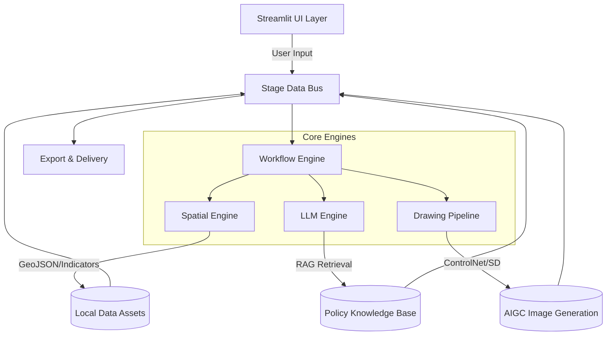
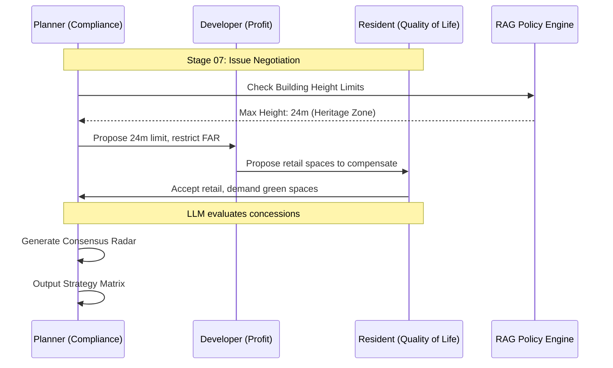
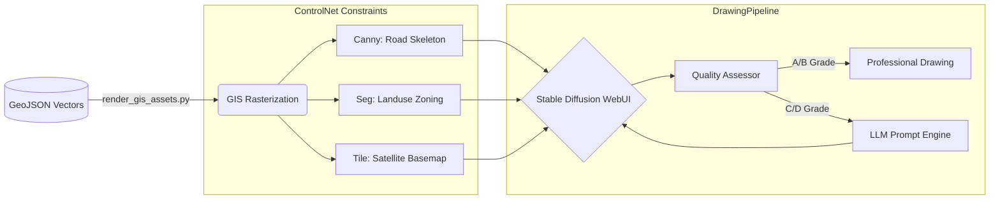

[**English**](./README_EN.md) · [**简体中文**](./README.md)

<div align="center">

# UltimateDESIGN

**AI-Powered Decision Support Platform for Urban Design & Micro-Renewal**

*Streamlit Full-Stack Engine · Decoupled Data & Logic · 15 Pages · GIS-to-AIGC Spatial Alignment · End-to-End Evidence-Based Workflow*

[](https://python.org)
[](https://streamlit.io)
[](./tests/)
[]()

</div>

---

## 🌟 Project Overview

UltimateDESIGN is a **Streamlit Full-Stack Intelligent Decision Support Platform** tailored for urban planning and micro-renewal design. Featuring a **strict decoupling of data and logic**, it supports the import of planning plots for any city. The platform deconstructs urban renewal design into 16 standardized stages, streamlining a complete digital twin workflow: GIS Data Collection → LLM Evidence-Based Reasoning → Vector/Raster Mapping → AIGC Conceptual Redrawing → Intelligent Delivery.



> 🎉 **New Feature: Out-of-the-Box Portable Version**
> The platform now fully supports a fully isolated, portable packaging solution based on **WinPython 3.12+**. All environment dependencies and underlying GIS C++ dynamic libraries are encapsulated within a single folder. Coupled with the built-in `安装向导_UltimateDESIGN.bat` wizard, it enables one-click deployment, pollution-free independent execution, and automatic shortcut generation, drastically lowering the distribution barrier for non-technical designers.

---

## ✨ Key Capabilities

| Capability | Description |
|---|---|
| **15-Page Streamlined Workflow** | 15 pages in total (app.py + 14 pages in pages/ with 3 merged stage-groups), focusing on core design flow |
| **26 Drawing Templates** | High-precision vector maps generated via Python and automatically assembled with standard A3 title blocks via PIL |
| **GIS → AIGC Alignment** | Novel Vector→Raster→ControlNet pipeline eliminates spatial hallucination |
| **Tri-Stakeholder Simulation** | LLM-driven Resident / Developer / Planner role-play with consensus radar output |
| **Dual Quality Loop** | Gemma visual + DeepSeek content assessment; auto-correction for C/D-rated outputs |
| **Versioned Atlas Export** | `VersionStore` full history + `BatchExporter` one-click 70+ drawing atlas |
| **HyperFrames Video** | One-click ~9 min defense video with 3D layered displays and GSAP animations |
| **Auto-Scrolling Controller** | Resident screen-recording HUD widget at the bottom right corner supporting frame-level smooth pixel-scrolling and shortcuts |
| **Auto Stage Summary Archiving**| Automatically extracts stage findings/methodologies and incrementally saves them in `output/stage_generation_report.md` sorted by stage order |
| **238 Automated Tests** | Pytest + CI integration: lint / secret scan / smoke test / data quality check |

---

## 🚀 Quick Start

### 📦 1. Installation

```powershell
git clone https://github.com/Chain813/ultimate-design.git
cd ultimate-design

# Option A: Automated script (Windows)
.\scripts\setup_env.bat

# Option B: Manual
conda create -n gis_ai python=3.12 -y && conda activate gis_ai
pip install -r requirements.txt
```

### ▶️ 2. Launch

```powershell
streamlit run app.py
# or double-click run.bat
```

Navigate via the **top navigation bar**, stages `[00]` through `[14]`.

### 🩺 3. Health Check

```powershell
python -m pytest                    # 238 unit tests
python tools/check_env.py           # 15-page integrity check
python tools/secret_scan.py         # Credential leak scan
```

---

## 🖥️ Engine Integration

The platform runs all analytical features in CPU-only mode. To activate AIGC drawing and LLM reasoning:

### 🧠 LLM Engine (DeepSeek / Ollama)

```env
# .env
DEEPSEEK_API_KEY="<your-api-key>"
```

### 🎨 Visual Rendering (Stable Diffusion WebUI)

Launch SD WebUI with `--api --listen` flags on `127.0.0.1:7860`.

### 🗺️ GIS Asset Rasterization

```powershell
python scripts/render_gis_assets.py
```

Converts GeoJSON vector data into ControlNet guidance maps (road skeleton / landuse segmentation / satellite basemap) stored in `static/assets/generated_base/`.

---

## 🔄 Workflow Stages

### 🟢 Diagnostics (Stage 00–05)

| Stage | Page | Core Function |
|---|---|---|
| 00 | Data Preparation | 16-category upload, quality check, coordinate sync |
| 01 | Brief Interpretation | Task brief parsing, constraint extraction |
| 02 | Data Collection | Semantic extraction engine, asset completeness |
| 03 | Site Survey | 458-point × 4-direction street view library |
| 04 | Status Analysis | WebGL 3D building base, POI aggregation, skyline |
| 05 | Problem Diagnosis | AHP-MPI renewal potential ranking, radar diagnostics |

### 🟡 Strategy (Stage 06–07)

| Stage | Page | Core Function |
|---|---|---|
| 06 | Goal Setting | LLM case benchmarking (Xintiandi / King's Cross) |
| 07 | Design Strategy | Tri-stakeholder simulation, consensus radar |

#### 🤖 Multi-Agent Negotiation Simulation (Stage 07)



### 🔴 Design & Delivery (Stage 08–13)

| Stage | Page | Core Function |
|---|---|---|
| 08 | Overall Urban Design | Spatial structure generation, Interactive landuse sandbox, AIGC masterplan |
| 09 | Specialized Systems | Transport & TOD / 15-min city / Skyline control / Heritage landscape planning |
| 10 | Key Plot Detailing | Radar diagnostics, Regulatory metrics, Micro-personas, Deep design schemes |
| 11 | Implementation Path | 6 renewal modes, 3-phase timeline Gantt chart |
| 12 | Design Guidelines | Two-step guideline generation + RAG policy retrieval |
| 13 | Output & Presentation | Python map rendering, Web LLM redraw prompts, Auto PIL title block |
| 14 | Data Dashboard | WebGL 3D macro-decision screen, planning indicator dashboard, spatiotemporal dynamic visualization |

### 🟣 AIGC & Agent Skills (Stage 15–16)

| Stage | Page | Core Function |
|---|---|---|
| 15 | AIGC Design Inference | 3D visual generation, ControlNet rendering, before/after contrast |
| 16 | Drawing Agent Skills | Planning drawing skill meta-instructions, interactive debugging & manual export |

---

## 🏗️ Project Structure

```text
ultimateDESIGN/
├── app.py                              # Entry point / Home / Global map base (1 page)
├── pages/                              # 14 functional pages (00–16)
├── src/
│   ├── config/                         # YAML config / paths / runtime flags
│   ├── engines/                        # AI & computation (NO UI code)
│   │   ├── llm_engine.py              #   DeepSeek / Ollama unified API
│   │   ├── stable_diffusion_engine.py #   SDPipeline (txt2img / ControlNet)
│   │   ├── drawing_pipeline.py        #   End-to-end drawing orchestrator
│   │   ├── frame_generator.py         #   PIL standard frame assembly
│   │   ├── urban_image_segmentation.py#   Street view segmentation engine
│   │   ├── engine_registry.py         #   AI engine registry
│   │   ├── quality_assessor.py        #   Dual quality assessment
│   │   ├── spatial_engine.py          #   GIS parsing / MPI / skyline
│   │   └── ...                        #   (20 engine modules total)
│   ├── ui/                             # Streamlit components & theming
│   ├── utils/                          # I/O, geo transform, service checks
│   └── workflow/                       # 17-stage state machine (00-16) & data bus
├── scripts/                            # Automation (data fetch / GIS render)
├── tools/                              # DevOps (env check / secret scan / QA)
│   ├── drawings/                      #   A3 layout rendering modules (dr_004.py ~ dr_slow_traffic.py)
├── tests/                              # 40 modules / 238 test cases
├── data/                               # Spatial & tabular assets (decoupled)
└── .github/workflows/ci.yml           # CI pipeline
```

---

## ⚙️ AIGC Pipeline Architecture



---

## 📚 Documentation

| Document | Description |
|---|---|
| [BUG_REPORT.md](./BUG_REPORT.md) | Known issues and fix log |
| [PROJECT_INSPECTION_REPORT.md](./PROJECT_INSPECTION_REPORT.md) | System architecture audit |
| [GLOSSARY.md](./GLOSSARY.md) | Terminology (MPI / GVI / ControlNet) |
| [README.md](./README.md) | 中文文档 |

---

<div align="center">
<sub>Built with Streamlit · Stable Diffusion · DeepSeek · GeoPandas · Plotly · HyperFrames</sub>
</div>
