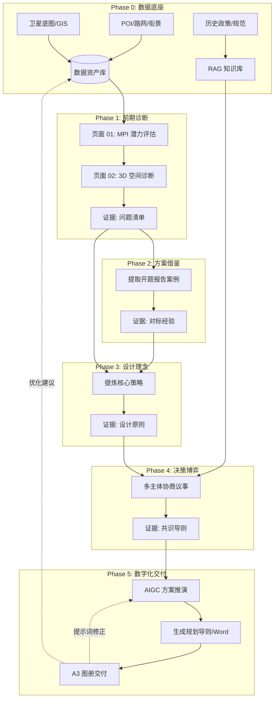

# 📑 循证规划五阶段推演工作流报告 (Workflow Report)

本项目采用**循证规划 (Evidence-based Planning)** 方法论，将传统的“设计主导”模式转变为“数据驱动-证据链传导-AI协同”的数字化工作流。

---

## 🎨 核心流程图 (Workflow Diagram)

---

## 🔬 阶段详细说明

### 阶段 0：数据底座 (Data Foundation)
- **目标**：建立数字孪生城市基底。
- **输入**：研究红线、建筑轮廓、路网、POI、政策 PDF。
- **工具**：GIS, Python, RAG 预热。

### 阶段 1：前期诊断 (Evidence Discovery)
- **目标**：识别街区核心痛点。
- **产出**：MPI 更新潜力分数、绿视率分析图、现状问题清单。
- **对应页面**：`01 数据底座` & `02 空间诊断`。

### 阶段 2：方案借鉴 (Benchmark Research)
- **目标**：从优秀案例中寻找解题思路。
- **方法**：自动检索《开题报告》中的案例，进行对标分析。
- **产出**：案例借鉴点位、本地化落地建议。

### 阶段 3：策略合成 (Strategy Synthesis)
- **目标**：形成初步设计导向。
- **逻辑**：将“问题”与“经验”结合，提炼出 4-6 条核心设计策略。
- **产出**：设计理念报告、空间分区建议。

### 阶段 4：共识博弈 (Consensus Negotiation)
- **目标**：解决利益冲突，达成规划共识。
- **过程**：模拟居委会、开发商、规划师三方博弈，由 RAG 实时进行政策合规校验。
- **产出**：共识度雷达图、问题-策略-依据对应表。

### 阶段 5：数字交付 (Digital Delivery)
- **目标**：生成最终可交付成果。
- **内容**：AIGC 渲染图、提示词、规划导则文本、自动生成的 Word 报告。
- **对应页面**：`03 AIGC 推演` & `05 成果展示`。

---

## 🛡️ 系统硬约束 (Hard Constraints)

在整个流转过程中，系统保持以下**“不可逾越”**的原则：
1. **边界固定**：AI 不得改写研究范围红线。
2. **空间真实**：建筑轮廓与道路拓扑关系必须保持真实，AI 只负责风貌修缮。
3. **政策先行**：所有策略必须经过 RAG 法规库的检索比对。

---

> 💡 **操作提示**：如需重新梳理，请确保 `pages/4_LLM博弈决策.py` 中的五阶段顺序与本报告保持一致。
