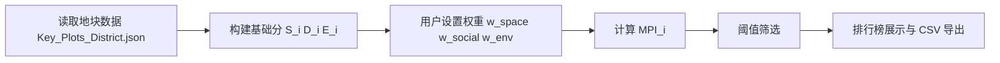
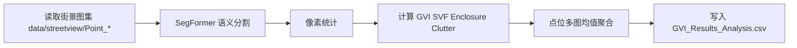
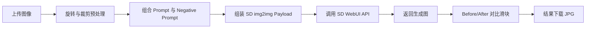
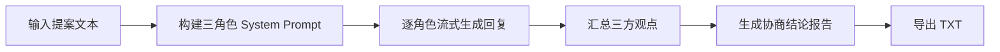

# UltimateDESIGN 论文附录版技术文档

> 本附录用于论文/答辩/评审场景，强调“可复现、可解释、可追溯”。

## A. 符号表（Notation）

| 符号 | 含义 | 取值范围 | 来源模块 |
| --- | --- | --- | --- |
| \(i\) | 第 \(i\) 个地块或空间单元 | \(i=1,\dots,N\) | 页面 1/2 |
| \(S_i\) | 空间潜力原分 | \([0,1]\) | 页面 1 |
| \(D_i\) | 社会需求原分 | \([0,1]\) | 页面 1 |
| \(E_i\) | 环境现状评分 | \([0,1]\) | 页面 1 |
| \(w_{space}\) | 空间潜力权重 | \([0,100]\) | 页面 1 |
| \(w_{social}\) | 社会需求权重 | \([0,100]\) | 页面 1 |
| \(w_{env}\) | 环境紧迫权重 | \([0,100]\) | 页面 1 |
| \(MPI_i\) | 多维更新潜力指数 | \([0,100]\) | 页面 1/2 |
| \(P\) | 图像总像素数 | \(>0\) | CV 引擎 |
| \(P_{veg}\) | 植被像素数 | \([0,P]\) | CV 引擎 |
| \(P_{sky}\) | 天空像素数 | \([0,P]\) | CV 引擎 |
| \(GVI\) | 绿视率 | \([0,100]\%\) | CV 引擎 |
| \(SVF\) | 天空开敞度 | \([0,100]\%\) | CV 引擎 |
| \(score_k\) | 第 \(k\) 条 RAG 片段匹配分 | 非负整数 | LLM 引擎 |
| \(p\) | 情感分类概率 | \([0,1]\) | NLP 引擎 |
| \(\epsilon\) | 防除零常数 | 0.001 | 页面 1 |

---

## B. 关键公式速查

### B.1 MPI

\[
MPI_i=\frac{w_{space}S_i+w_{social}D_i+w_{env}(1-E_i)}{w_{space}+w_{social}+w_{env}+\epsilon}\times100
\]

### B.2 AHP 归一化

\[
\mathbf{w}'=\frac{\mathbf{w}}{\sum \mathbf{w}+\epsilon},\ \mathbf{w}=[w_{space},w_{social},w_{env}]
\]

### B.3 AHP 判断矩阵

\[
A_{ij}=\frac{w'_i}{w'_j+\epsilon}
\]

### B.4 城市视觉指数

\[
GVI=\frac{P_{veg}}{P}\times100,\quad
SVF=\frac{P_{sky}}{P}\times100
\]

\[
Enclosure=\frac{P_{building}+P_{wall}+P_{veg}}{P}\times100
\]

\[
Clutter=\frac{P_{pole}+P_{sign}+P_{light}+P_{fence}}{P}\times100
\]

### B.5 RAG 片段匹配得分

\[
score_k=\sum_{w\in W}\mathbf{1}(w\in C_k)
\]

### B.6 情感分值映射

\[
score=
\begin{cases}
p,&positive\\
0,&neutral\\
-p,&negative
\end{cases}
\]

---

## C. 参数默认值表（实验复现基线）

## C.1 页面 1（MPI/AHP）

| 参数 | 默认值 | 作用 |
| --- | --- | --- |
| 空间潜力权重 | 40 | 调整 \(S_i\) 贡献 |
| 社会需求权重 | 30 | 调整 \(D_i\) 贡献 |
| 环境紧迫权重 | 30 | 调整 \(1-E_i\) 贡献 |
| 阈值 | 0 | 筛选最小 MPI |

## C.2 页面 2（3D/诊断）

| 参数 | 默认值 | 作用 |
| --- | --- | --- |
| 日照推演时间 | 10 | 地图光照时间 |
| 柱体拉伸倍数 | 40 | 柱状图高度缩放 |
| 柱体覆盖半径 | 25 | 柱体空间覆盖范围 |
| 蜂窝半径 | 60 | 活力聚合尺度 |
| 活力拉伸倍数 | 5.0 | Hex 高度缩放 |

## C.3 页面 3（AIGC）

| 参数 | 默认值 | 作用 |
| --- | --- | --- |
| Control Weight | 1.0 | 结构约束强度 |
| Sampling Steps | 20 | 采样迭代次数 |
| CFG Scale | 7.0 | 文本约束强度 |
| Denoising | 0.55 | 重绘幅度 |
| Sampler | DPM++ 2M Karras | 采样器 |
| Seed | 428931 | 复现实验随机种 |

## C.4 页面 4（LLM）

| 参数 | 默认值 | 作用 |
| --- | --- | --- |
| 模型标签 | gemma4:e2b-it-q4_K_M | 本地推理模型 |
| Temperature（UI） | 0.7 | 决策倾向展示参数（当前未入请求体） |
| 流式输出 | 开启 | 改善交互体验 |

---

## D. 可复现实验流程（逐步）

## D.1 环境复现

1. 安装 Python 3.10（建议）  
2. 执行：

```bash
python -m venv .venv
.venv\Scripts\activate
pip install -r requirements.txt
```

3. 配置 `.env`：

```env
Baidu_Map_AK=YOUR_REAL_KEY
```

4. 启动外部服务：
   - Ollama（11434）
   - Stable Diffusion WebUI API（7860，含 `--api`）

5. 启动应用：

```bash
streamlit run app.py
```

## D.2 质量复现

```bash
ruff check .
pytest -q
python tools/check_env.py
python tools/startup_smoke.py
python tools/secret_scan.py
```

## D.3 指标复现实验（建议模板）

1. 固定同一批输入数据  
2. 固定权重/seed/模型版本  
3. 记录输出（CSV、图像、报告）  
4. 对比版本差异并写入实验记录表

---

## E. 处理流程图（Mermaid 版）

## E.1 MPI 流程



## E.2 CV 流程



## E.3 AIGC 流程



## E.4 LLM 流程



---

## F. 失败案例清单与排障

## F.1 服务类

- **现象**：AIGC 渲染失败  
  **原因**：SD API 未启动或端点不通  
  **处理**：确认 `config.yaml` URL 与端口；检查 `--api` 是否启用

- **现象**：LLM 无响应  
  **原因**：Ollama 未运行或模型未下载  
  **处理**：执行 `ollama run gemma4:e2b-it-q4_K_M`

## F.2 数据类

- **现象**：页面图层空白  
  **原因**：`data/*.csv` 或 `data/shp/*` 缺失  
  **处理**：运行 `python tools/check_env.py`

- **现象**：舆情加载乱码  
  **原因**：编码不一致  
  **处理**：优先 `utf-8-sig`，失败后 `gbk` 回退（系统已内置）

## F.3 工程类

- **现象**：本地通过但 CI 失败  
  **原因**：依赖漂移、未执行完整校验  
  **处理**：本地先跑 `ruff + pytest + smoke`

- **现象**：提交被拦截  
  **原因**：pre-commit 未通过  
  **处理**：`pre-commit run --all-files` 修复后再提交

---

## G. 结果归档建议（答辩/论文）

建议每组实验保存以下工件：

1. 输入快照（数据版本、配置、参数）
2. 输出快照（MPI CSV、AIGC 图、协商报告）
3. 运行日志（时间、模型版本、异常信息）
4. 结论摘要（对照实验差异）

可按 `experiments/YYYYMMDD_runXX/` 组织归档。
