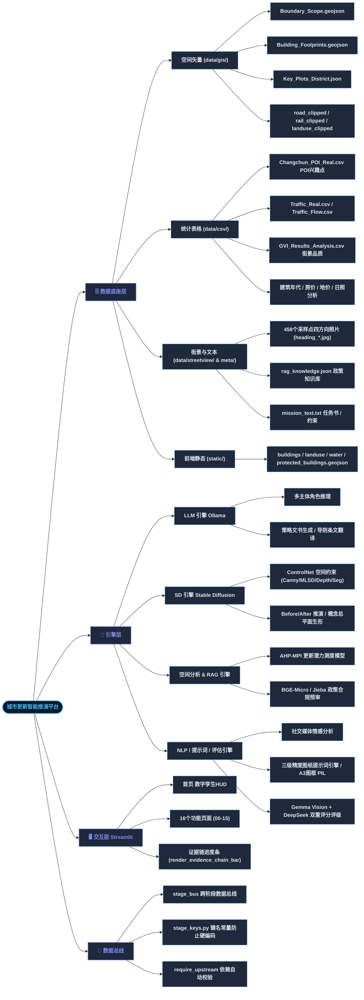
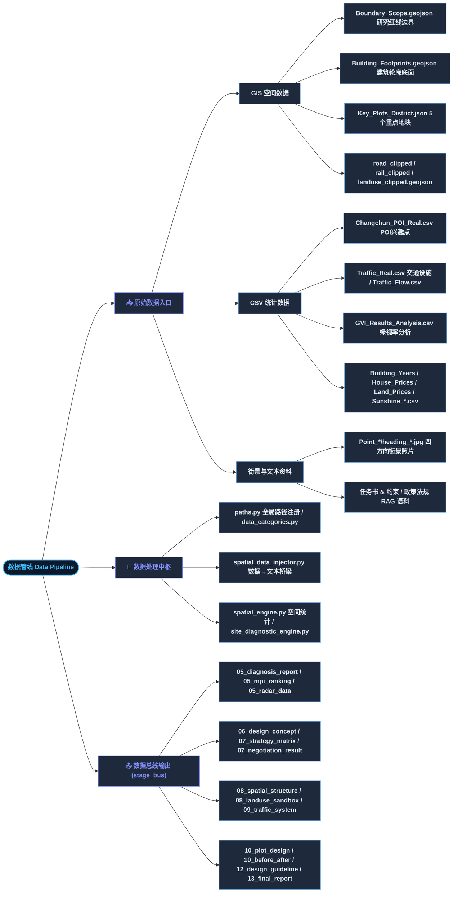
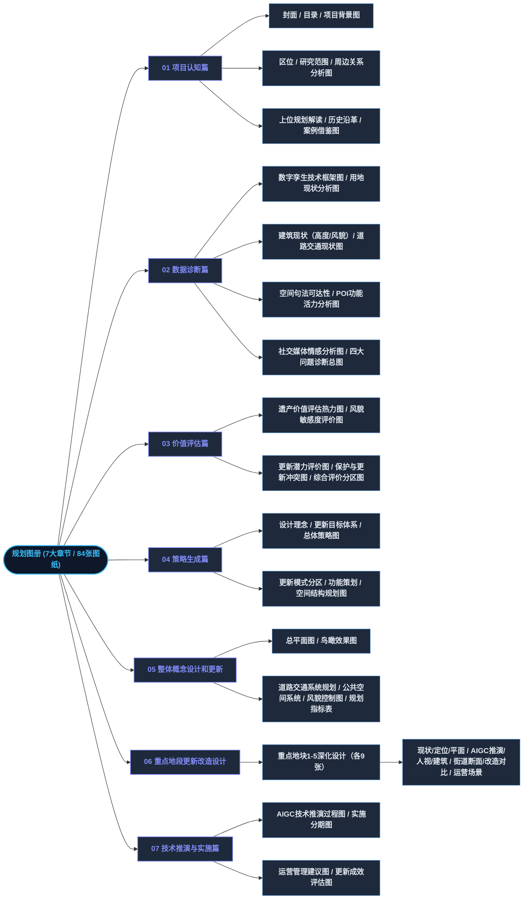

# 城市更新平台核心流程图集

以下是项目的三大核心流程图。**您可以在当前界面的右侧/独立窗口直接看到渲染出的图形！**

## 1. 核心系统架构图

```mermaid
flowchart LR
    classDef default fill:#1e293b,stroke:#64a0dc,stroke-width:1px,color:#e2e8f0;
    classDef root fill:#0f172a,stroke:#38bdf8,stroke-width:2px,color:#38bdf8,font-weight:bold;
    classDef group fill:#1e293b,stroke:#818cf8,stroke-width:1.5px,color:#818cf8;
    
    root(["城市更新智能推演平台"]):::root
    
    %% 层级 1
    L1["🗄️ 数据底座层"]:::group
    L2["🔧 引擎层"]:::group
    L3["🖥️ 交互层 Streamlit"]:::group
    L4["📡 数据总线"]:::group
    
    root --> L1
    root --> L2
    root --> L3
    root --> L4
    
    %% 数据底座层子节点
    L1 --> L1_1["空间矢量 (data/gis/)"]
    L1_1 --> L1_1_1["Boundary_Scope.geojson"]
    L1_1 --> L1_1_2["Building_Footprints.geojson"]
    L1_1 --> L1_1_3["Key_Plots_District.json"]
    L1_1 --> L1_1_4["road_clipped / rail_clipped / landuse_clipped"]
    
    L1 --> L1_2["统计表格 (data/csv/)"]
    L1_2 --> L1_2_1["Changchun_POI_Real.csv POI兴趣点"]
    L1_2 --> L1_2_2["Traffic_Real.csv / Traffic_Flow.csv"]
    L1_2 --> L1_2_3["GVI_Results_Analysis.csv 街景品质"]
    L1_2 --> L1_2_4["建筑年代 / 房价 / 地价 / 日照分析"]
    
    L1 --> L1_3["街景与文本 (data/streetview/ & meta/)"]
    L1_3 --> L1_3_1["458个采样点四方向照片 (heading_*.jpg)"]
    L1_3 --> L1_3_2["rag_knowledge.json 政策知识库"]
    L1_3 --> L1_3_3["mission_text.txt 任务书 / 约束"]
    
    L1 --> L1_4["前端静态 (static/)"]
    L1_4 --> L1_4_1["buildings / landuse / water / protected_buildings.geojson"]
    
    %% 引擎层子节点
    L2 --> L2_1["LLM 引擎 Ollama"]
    L2_1 --> L2_1_1["多主体角色推理"]
    L2_1 --> L2_1_2["策略文书生成 / 导则条文翻译"]
    
    L2 --> L2_2["SD 引擎 Stable Diffusion"]
    L2_2 --> L2_2_1["ControlNet 空间约束 (Canny/MLSD/Depth/Seg)"]
    L2_2 --> L2_2_2["Before/After 推演 / 概念总平面生形"]
    
    L2 --> L2_3["空间分析 & RAG 引擎"]
    L2_3 --> L2_3_1["AHP-MPI 更新潜力测度模型"]
    L2_3 --> L2_3_2["BGE-Micro / Jieba 政策合规预审"]
    
    L2 --> L2_4["NLP / 提示词 / 评估引擎"]
    L2_4 --> L2_4_1["社交媒体情感分析"]
    L2_4 --> L2_4_2["三级精度图纸提示词引擎 / A3图框 PIL"]
    L2_4 --> L2_4_3["Gemma Vision + DeepSeek 双重评分评级"]
    
    %% 交互层子节点
    L3 --> L3_1["首页 数字孪生HUD"]
    L3 --> L3_2["16个功能页面 (00-15)"]
    L3 --> L3_3["证据链进度条 (render_evidence_chain_bar)"]
    
    %% 数据总线子节点
    L4 --> L4_1["stage_bus 跨阶段数据总线"]
    L4 --> L4_2["stage_keys.py 键名常量防止硬编码"]
    L4 --> L4_3["require_upstream 依赖自动校验"]
```

## 2. 数据管线解析图

```mermaid
flowchart LR
    classDef default fill:#1e293b,stroke:#64a0dc,stroke-width:1px,color:#e2e8f0;
    classDef root fill:#0f172a,stroke:#38bdf8,stroke-width:2px,color:#38bdf8,font-weight:bold;
    classDef group fill:#1e293b,stroke:#818cf8,stroke-width:1.5px,color:#818cf8;

    root(["数据管线 Data Pipeline"]):::root
    
    L1["📥 原始数据入口"]:::group
    L2["🔄 数据处理中枢"]:::group
    L3["📤 数据总线输出 (stage_bus)"]:::group
    
    root --> L1
    root --> L2
    root --> L3
    
    %% 原始数据入口
    L1 --> L1_1["GIS 空间数据"]
    L1_1 --> L1_1_1["Boundary_Scope.geojson 研究红线边界"]
    L1_1 --> L1_1_2["Building_Footprints.geojson 建筑轮廓底面"]
    L1_1 --> L1_1_3["Key_Plots_District.json 5个重点地块"]
    L1_1 --> L1_1_4["road_clipped / rail_clipped / landuse_clipped.geojson"]
    
    L1 --> L1_2["CSV 统计数据"]
    L1_2 --> L1_2_1["Changchun_POI_Real.csv POI兴趣点"]
    L1_2 --> L1_2_2["Traffic_Real.csv 交通设施 / Traffic_Flow.csv"]
    L1_2 --> L1_2_3["GVI_Results_Analysis.csv 绿视率分析"]
    L1_2 --> L1_2_4["Building_Years / House_Prices / Land_Prices / Sunshine_*.csv"]
    
    L1 --> L1_3["街景与文本资料"]
    L1_3 --> L1_3_1["Point_*/heading_*.jpg 四方向街景照片"]
    L1_3 --> L1_3_2["任务书 & 约束 / 政策法规 RAG 语料"]
    
    %% 数据处理中枢
    L2 --> L2_1["paths.py 全局路径注册 / data_categories.py"]
    L2 --> L2_2["spatial_data_injector.py 数据→文本桥梁"]
    L2 --> L2_3["spatial_engine.py 空间统计 / site_diagnostic_engine.py"]
    
    %% 数据总线输出
    L3 --> L3_1["05_diagnosis_report / 05_mpi_ranking / 05_radar_data"]
    L3 --> L3_2["06_design_concept / 07_strategy_matrix / 07_negotiation_result"]
    L3 --> L3_3["08_spatial_structure / 08_landuse_sandbox / 09_traffic_system"]
    L3 --> L3_4["10_plot_design / 10_before_after / 12_design_guideline / 13_final_report"]
```

## 3. 规划图册清单总表

```mermaid
flowchart LR
    classDef default fill:#1e293b,stroke:#64a0dc,stroke-width:1px,color:#e2e8f0;
    classDef root fill:#0f172a,stroke:#38bdf8,stroke-width:2px,color:#38bdf8,font-weight:bold;
    classDef group fill:#1e293b,stroke:#818cf8,stroke-width:1.5px,color:#818cf8;

    root(["规划图册 (7大章节 / 84张图纸)"]):::root
    
    C1["01 项目认知篇"]:::group
    C2["02 数据诊断篇"]:::group
    C3["03 价值评估篇"]:::group
    C4["04 策略生成篇"]:::group
    C5["05 整体概念设计和更新"]:::group
    C6["06 重点地段更新改造设计"]:::group
    C7["07 技术推演与实施篇"]:::group
    
    root --> C1
    root --> C2
    root --> C3
    root --> C4
    root --> C5
    root --> C6
    root --> C7
    
    C1 --> C1_1["封面 / 目录 / 项目背景图"]
    C1 --> C1_2["区位 / 研究范围 / 周边关系分析图"]
    C1 --> C1_3["上位规划解读 / 历史沿革 / 案例借鉴图"]
    
    C2 --> C2_1["数字孪生技术框架图 / 用地现状分析图"]
    C2 --> C2_2["建筑现状（高度/风貌）/ 道路交通现状图"]
    C2 --> C2_3["空间句法可达性 / POI功能活力分析图"]
    C2 --> C2_4["社交媒体情感分析图 / 四大问题诊断总图"]
    
    C3 --> C3_1["遗产价值评估热力图 / 风貌敏感度评价图"]
    C3 --> C3_2["更新潜力评价图 / 保护与更新冲突图 / 综合评价分区图"]
    
    C4 --> C4_1["设计理念 / 更新目标体系 / 总体策略图"]
    C4 --> C4_2["更新模式分区 / 功能策划 / 空间结构规划图"]
    
    C5 --> C5_1["总平面图 / 鸟瞰效果图"]
    C5 --> C5_2["道路交通系统规划 / 公共空间系统 / 风貌控制图 / 规划指标表"]
    
    C6 --> C6_1["重点地块1-5深化设计（各9张）"]
    C6_1 --> C6_2["现状/定位/平面 / AIGC推演/人视/建筑 / 街道断面/改造对比 / 运营场景"]
    
    C7 --> C7_1["AIGC技术推演过程图 / 实施分期图"]
    C7 --> C7_2["运营管理建议图 / 更新成效评估图"]
```
